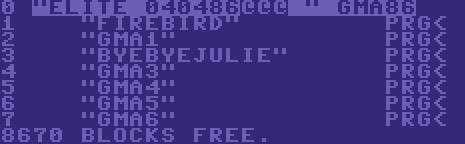

# Elite GMA86 Loader Theory of Operation #

There are multiple releases of Elite for the Commodore 64; at least 6:

* Original PAL & NTSC releases, 1985
* PAL & NTSC re-releases, 1986
* German and German Gold-Edition releases, 1988

Whilst the game runs from RAM once loaded, without the need to load other code modules from disk -- a benefit of having 64 KB of RAM -- the addition of copy protection and obfuscation through encryption and re-locating of code/data chunks means that the whole process of getting the game running from the moment you call `LOAD"*",8,1` is quite, quite convoluted and complex.

The original PAL & NTSC releases, being as they were their debut, are heavily copy-protected, even going as far as using the dreaded, unreliable [LensLok][lenslok]. Initial releases like these tend to have embedded anti-tamper checks buried within the game code, intended to break the game even if the would-be-cracker can get past the loader.

[lenslok]:  https://en.wikipedia.org/wiki/Lenslok

For these reasons, I opted to avoid the initial releases of Elite for disassembly as it could be a long time before any ticking time-bombs could be tracked down and defused.

Initially, I was going to reverse-engineer the German Gold-Edition as it represents the 'latest' version of the code and therefore the most likely version to have bug-fixes. Also, it's believed that the German Gold-Edition is effectively unprotected, given its late release in 1988, by which time pirate copies of Elite had already been floating around for four years already, and with the Amiga and Atari ST making large inroads in Germany at the time, there was little commercial value in excessive copy-protection for an old game on an out-dated system.

It was thanks to [Lemon 64][lemon64] forum user *nc513* who demonstrated that the 1986 re-releases, known colloquially as "GMA85" (NTSC) / "GMA86" (PAL) due to the disk ID -- the loader having been written by one [GMA][gma] -- only contained copy-protection in the loader which could be circumvented with a simple three-byte patch; therefore my focus switched to the "GMA86" disk version.

[lemon64]:  http://www.lemon64.com/
[gma]:      https://csdb.dk/scener/?id=18508

The Elite GMA86 disk contains six .PRG files:

(The file sizes have been faked through manual manipulation of the disk layout, a further attempt at preventing casual copying)

## Stage 0: From the KERNAL ##

All programs, no matter how copy-protected they may be, must begin with a program compatible with the built-in loading routines on the C64 so that the user may enter `LOAD"*",8,1` and it work as expected.

Since the 1541 disk drive is so punishingly slow this first program is typically a small bootstrap or "stub" that provides new fast-loading routines to load the rest of the game with.

"FIREBIRD" is the first program in the directory and is what gets loaded when you enter `LOAD"*",8,1` but you might notice that, compared to typical programs on the C64, the program starts running automatically without you having to type `RUN`; how is this done?

Commodore 64 "PRG" files always begin with a two-byte address header that specifies where in memory to load the program; BASIC programs always load from `$0801`. "FIREBIRD.PRG" loads at `$02A7`, well underneath the BASIC area and in-amongst some pretty important space used by the KERNAL. Let's have a closer look:

---

To be continued...